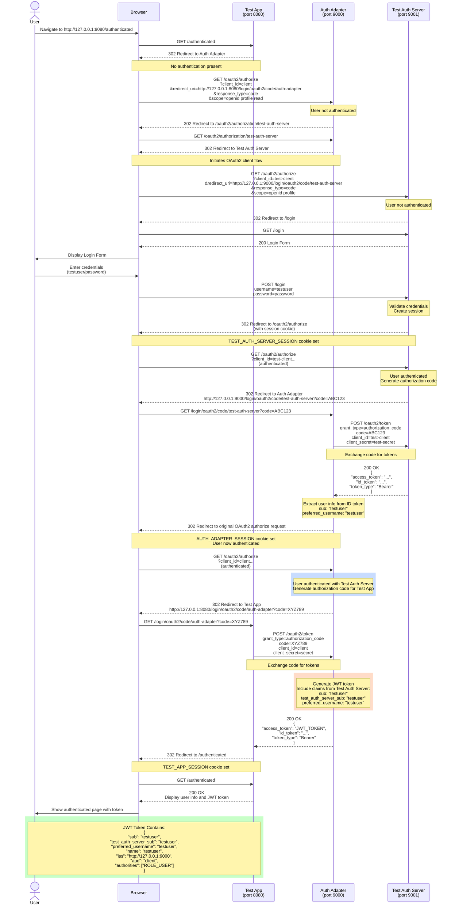

# Chained Authentication Flow - Sequence Diagram

This document contains a Mermaid sequence diagram illustrating the complete chained authentication flow between the test-app, auth-adapter, and test-auth-server.

## Flow Diagram

## Flow Description

### Phase 1: Initial Request (Steps 1-3)
1. User navigates to the test-app's protected page
2. Test-app detects no authentication and redirects to auth-adapter
3. User is sent to auth-adapter's OAuth2 authorization endpoint

### Phase 2: Chained Authentication (Steps 4-6)
4. Auth-adapter detects user is not authenticated
5. Auth-adapter redirects to test-auth-server (as OAuth2 client)
6. Test-auth-server requires authentication and shows login form

### Phase 3: User Authentication (Steps 7-11)
7. User sees test-auth-server login form
8. User enters credentials (testuser/password)
9. Test-auth-server validates credentials and creates session
10. Test-auth-server redirects back to OAuth2 authorization flow
11. Authorization code is generated and sent to auth-adapter

### Phase 4: Auth Adapter Token Exchange (Steps 12-14)
12. Auth-adapter receives authorization code from test-auth-server
13. Auth-adapter exchanges code for access token and ID token
14. Auth-adapter extracts user identity (sub: "testuser") from ID token
15. User is now authenticated in auth-adapter

### Phase 5: Test App Authorization (Steps 15-18)
16. Auth-adapter generates authorization code for test-app
17. Test-app exchanges code for JWT token
18. Auth-adapter creates JWT with test-auth-server identity claims

### Phase 6: Display Result (Steps 19-20)
19. Test-app receives JWT token containing test-auth-server identity
20. User sees authenticated page with token details

## Key Points

- **Primary Identity**: Comes from test-auth-server (testuser)
- **Chained Flow**: Test-app → Auth-adapter → Test-auth-server
- **Three Sessions**: Each service maintains its own session cookie
- **JWT Token**: Contains the `sub` claim from test-auth-server
- **No GitHub**: GitHub authentication is optional/secondary in this flow

## Token Customization

The auth-adapter uses `ChainedAuthTokenCustomizer` to ensure the JWT token contains:
- `sub`: Primary identity from test-auth-server
- `test_auth_server_sub`: Backup claim for traceability
- `preferred_username`: Username from test-auth-server
- `authorities`: User roles from test-auth-server

This ensures the test-auth-server identity is preserved throughout the entire chain.
