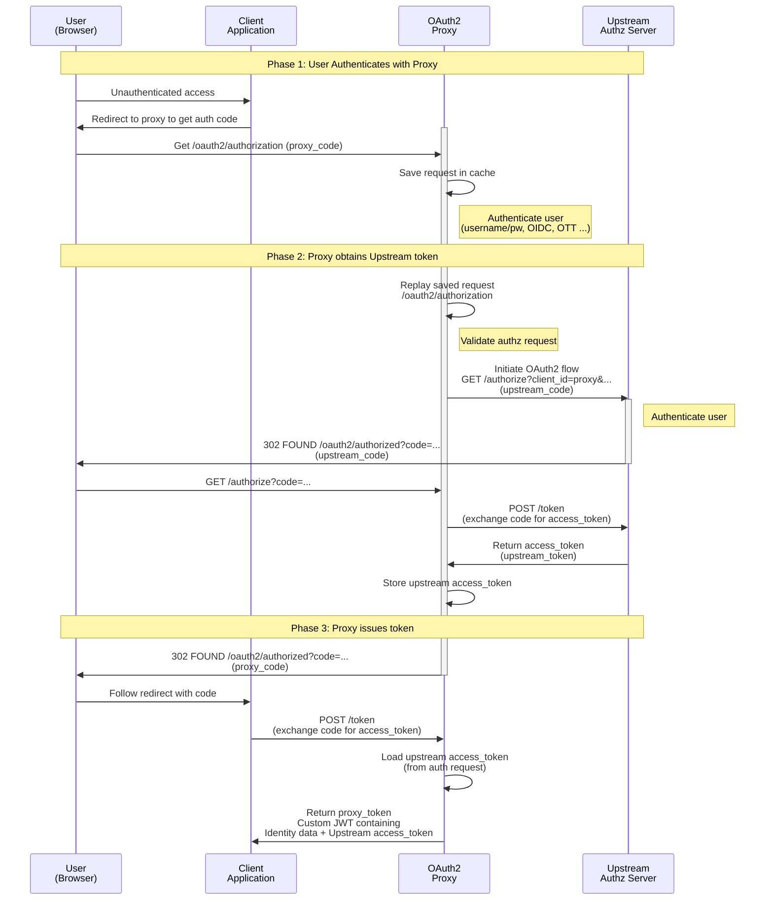

```mermaid
sequenceDiagram
    participant User as User<br/>(Browser)
    participant Client as Client<br/>Application
    participant Proxy as OAuth2<br/>Proxy
    participant Upstream as Upstream<br/>Authz Server

    Note over User,Upstream: Phase 1: User Authenticates with Proxy

    User->>Client: Unauthenticated access
    Client->>User: Redirect to proxy to get auth code
    activate Proxy
    User->>Proxy: Get /oauth2/authorization (proxy_code)
    Proxy->>Proxy: Save request in cache
    Note right of Proxy: Authenticate user<br/>(username/pw, OIDC, OTT ...)

    Note over User,Upstream: Phase 2: Proxy obtains Upstream token

    Proxy->>Proxy: Replay saved request<br/>/oauth2/authorization
    Note right of Proxy: Validate authz request
    Proxy->>Upstream: Initiate OAuth2 flow<br/>GET /authorize?client_id=proxy&...<br/>(upstream_code)
    activate Upstream
    Note right of Upstream: Authenticate user
    Upstream->>User: 302 FOUND /oauth2/authorized?code=...<br/>(upstream_code)
    deactivate Upstream
    User->>Proxy: GET /authorize?code=...
    Proxy->>Upstream: POST /token<br/>(exchange code for access_token)
    Upstream->>Proxy: Return access_token<br/>(upstream_token)
    Proxy->>Proxy: Store upstream access_token

    Note over User,Upstream: Phase 3: Proxy issues token

    Proxy->>User: 302 FOUND /oauth2/authorized?code=...<br/>(proxy_code)
    deactivate Proxy
    User->>Client: Follow redirect with code
    Client->>Proxy: POST /token<br/>(exchange code for access_token)
    Proxy->>Proxy: Load upstream access_token<br/>(from auth request)
    Proxy->>Client: Return proxy_token<br/>Custom JWT containing<br/>Identity data + Upstream access_token
```